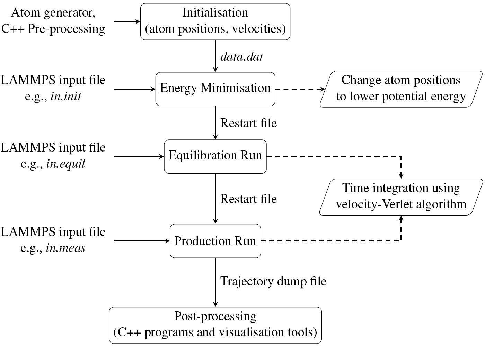

# Scattering Kernel

A code to simulate, pre-process, and post-process gas-surface interaction using molecular dynamics (MD).

This code is open source and provided freely. We would appreciate it if scientific work done using this code includes an explicit acknowledgment and cites the following references, which served as a basis for this code:

Chen, Y., Gibelli, L. and Borg, M.K., 2024. Impact of random nanoscale roughness on gas-scattering dynamics. [*Physical Review E*, 109(6), p.065308.](https://journals.aps.org/pre/abstract/10.1103/PhysRevE.109.065308)

Chen, Y., Gibelli, L., Li, J. and Borg, M.K., 2023. Impact of surface physisorption on gas scattering dynamics. [*Journal of Fluid Mechanics*, 968, p.A4.](https://www.cambridge.org/core/journals/journal-of-fluid-mechanics/article/impact-of-surface-physisorption-on-gas-scattering-dynamics/F5365B8E1F4B8B7ECADC44DC1766B5B8)

Chen, Y., Li, J., Datta, S., Docherty, S.Y., Gibelli, L. and Borg, M.K., 2022. Methane scattering on porous kerogen surfaces and its impact on mesopore transport in shale. [*Fuel*, 316, p.123259.](https://www.sciencedirect.com/science/article/abs/pii/S0016236122001284)

----------------------------------------------------------------------

The *Scattering Kernel* includes the following files and directories:

README                - This file
LICENSE               - The GNU General Public License (GPL)
examples              - Simple test problems
initialisation        - Pre-processing of MD configuration
LAMMPS_input          - Example LAMMPS input scripts
tools                 - Post-processing of LAMMPS dump files
Makefile              - Compilation of various post-processing C++ files