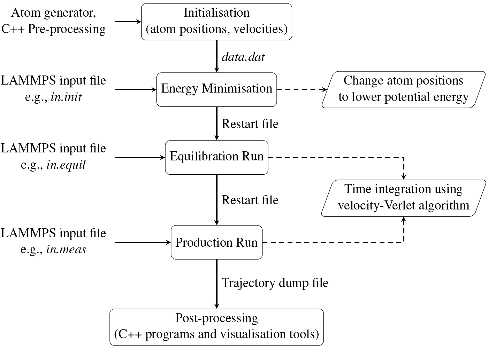

# Scattering Kernel

A code to simulate, pre-process, and post-process gas-surface interaction using molecular dynamics (MD).

This code is open source and provided freely. We would appreciate it if scientific work done using this code includes an explicit acknowledgment and cites the following references, which served as a basis for this code:

Chen, Y., Xiao, T., Meng, B., Zhang, G., Wang, Y., Wang, X. and Zhang, Y., 2026. Structural limitations of gas-surface scattering kernels for rarefied hypersonic aerothermodynamic prediction. *Theoretical and Applied Mechanics Letters*, in press.

Chen, Y., Gibelli, L. and Borg, M.K., 2024. Impact of random nanoscale roughness on gas-scattering dynamics. [*Physical Review E*, 109(6), p.065308.](https://journals.aps.org/pre/abstract/10.1103/PhysRevE.109.065308)

Chen, Y., Gibelli, L., Li, J. and Borg, M.K., 2023. Impact of surface physisorption on gas scattering dynamics. [*Journal of Fluid Mechanics*, 968, p.A4.](https://www.cambridge.org/core/journals/journal-of-fluid-mechanics/article/impact-of-surface-physisorption-on-gas-scattering-dynamics/F5365B8E1F4B8B7ECADC44DC1766B5B8)

Chen, Y., Li, J., Datta, S., Docherty, S.Y., Gibelli, L. and Borg, M.K., 2022. Methane scattering on porous kerogen surfaces and its impact on mesopore transport in shale. [*Fuel*, 316, p.123259.](https://www.sciencedirect.com/science/article/abs/pii/S0016236122001284)

The repository also carries the DSMC side of the same problem. Two wall models for SPARTA take the accommodation coefficients from molecular dynamics, resolved in incident energy and angle, and a third resamples the scattering events directly. The tables, the event library and the input decks that run them are included, as used in Chen et al. (2026) above.

----------------------------------------------------------------------
The *ScatteringKernels* repository includes the following files and directories:

README              - this file      
LICENSE.md          - the GNU General Public License, version 3       
examples            - simple test problems       
initialisation      - pre-processing of MD configuration         
LAMMPS_input        - example LAMMPS input scripts       
LAMMPS_input/Beam_ArPt - molecular beam runs for Ar on Pt and the table builders
LAMMPS_src          - implementation of scattering kernels in LAMMPS        
SPARTA_input        - example SPARTA input decks, wall model tables and post-processing
SPARTA_src          - implementation of scattering kernels in SPARTA
tools               - post-processing of LAMMPS dump files      
Makefile            - builds the programs in tools/ and runs the regression checks
docs                - documentation, including docs/legacy_tools.md for the programs in tools/
scripts             - helper scripts, including scripts/rundir.mk for simulation directories
tests               - reference answers and regression checks



## Building the post-processing tools

The programs in `tools/` read LAMMPS dump files and write accommodation
coefficients, velocity and angle distributions, density profiles and more.
They need only a C++ compiler and make:

```bash
make            # compiles every tools/*.cpp into build/bin/
make test       # checks the repository, then runs the tools on stored reference dumps
make help       # the other targets
```

The programs are compiled with no flags, as they were for the published
results. [docs/legacy_tools.md](docs/legacy_tools.md) explains what each one
computes, which files it reads and writes, how to fill in
`Specification.dat`, and the known issues.
